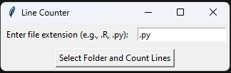
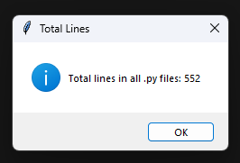
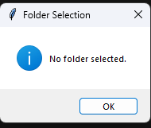

# Code Counter
This is a simple Python script that scans a given folder and counts the amount of lines of code for a specific file extension. It is intended to be used on project where code is written accross multiple scripts, which makes counting the amount of lines difficult. Does this solve a real problem? No. But it is something I am often curious about, so that is why I made it.

## Required packages
- os
- tkinter
  + filedialog
  + messagebox

## How to use
It is reasonably self explanatory. On launch you are presented with the following interface:

Enter your file extension and click "Select Folder". A file dialog window will appear. After selecting the file, the number of lines of code will appear: (This might take a second depending on the size of the folder)

Lastly, if it wasn't obvious, if you receive a pop-up like this:

It means you didn't select a folder.